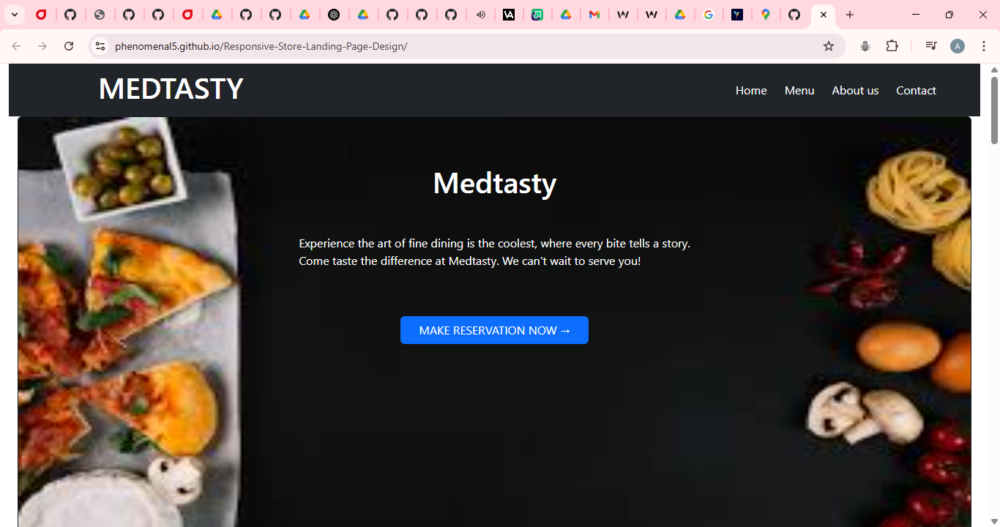
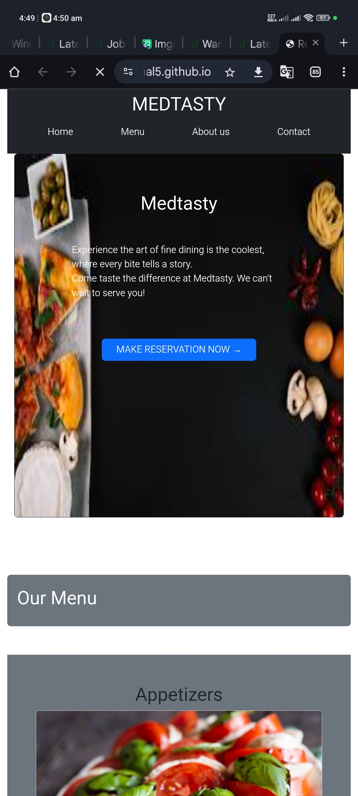

# 🛍️ Responsive Store Landing Page Design

## 📌 Project Overview

This project is a **responsive landing page** for an online store, designed with a focus on modern UI principles, responsiveness, and usability. It includes a structured layout with a **header**, **product showcase**, and a **footer**, and ensures optimal display across desktop and mobile devices.

🔗 [Live Preview](https://github.com/Phenomenal5/Responsive-Store-Landing-Page-Design)

---

## 🎯 Objective

- Build a visually appealing and functional store landing page.
- Ensure responsive behavior across various screen sizes.
- Implement product cards and clean navigation.

---

## 🧱 Features & Requirements

### ✅ HTML Structure

- Semantic HTML layout with:
  - **Header**: Includes navigation menu with section links.
  - **Product Section**: At least four product cards.
  - **Footer**: Placeholder for social media or copyright.

### ✅ CSS Styling

- Custom styling to give a **modern and clean look**.
- Consistent use of colors, spacing, and typography.
- Media queries applied to ensure the page adjusts to screen sizes.

### ✅ Product Section

- Each product card includes:
  - Product **image**
  - Product **name**
  - Short **description**
  - "Shop Now" **button**
- Styled to ensure consistency, alignment, and visual appeal.

### ✅ Responsive Design

- Built using **mobile-first design principles**.
- **Media queries** used for breakpoint adjustments.
- Optimized layout for mobile, tablet, and desktop.

---

## 🌐 Technologies Used

- **HTML5**
- **CSS3**
- Optional CSS Library:
  - **Tailwind CSS** (or **Bootstrap**) can be added for enhanced responsiveness and utilities.

---

## 💡 Optional Enhancements (Extra Points)

- Integration of a **CSS framework** (e.g., Tailwind CSS or Bootstrap).
- Use of **hover effects**, **transitions**, or **grid/flexbox** layouts.
- Animated scroll or enhanced button interactions.

---

## 📸 Screenshots

### 💻 Desktop View



### 📱 Mobile View



> *Make sure to replace these image paths with your actual screenshots inside a `/screenshots/` directory.*

---

## 📝 Developer Notes

- **Design Choices**:
  - Clean and minimalist layout for better UX.
  - Cards designed with consistent sizing and spacing.
  - Color palette chosen for contrast and readability.

- **Best Practices**:
  - Semantic HTML used.
  - Responsive typography and spacing.
  - Well-commented code for clarity and maintainability.

---

## 🚀 Getting Started

To run this project locally:

```bash
git clone https://github.com/Phenomenal5/Responsive-Store-Landing-Page-Design.git
cd Responsive-Store-Landing-Page-Design
open index.html
